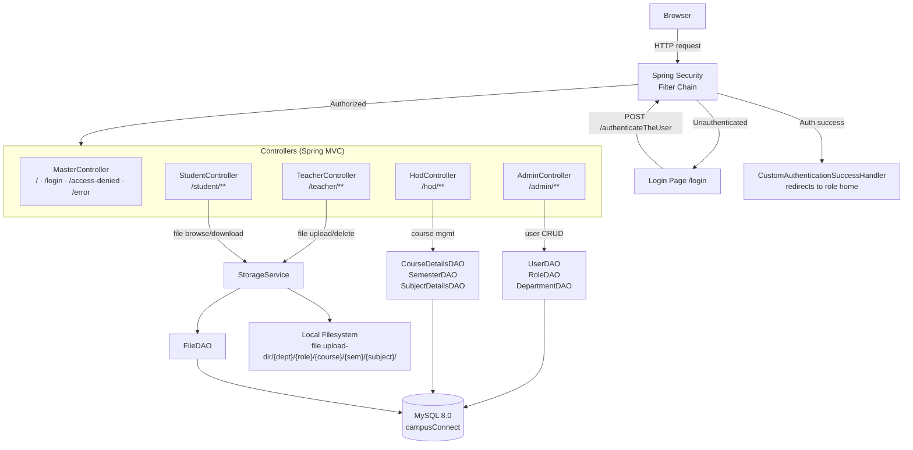

# CampusConnect — Architecture

## System Architecture

The application follows a standard Spring MVC layered architecture. All HTTP requests pass through Spring Security before reaching any controller, and role-based URL prefixes determine access at the filter level. Thymeleaf renders server-side HTML; no separate frontend build step is involved.



### Layer responsibilities

| Layer | Package | Responsibility |
|-------|---------|----------------|
| Controllers | `controller/` | Receive HTTP requests, bind model data, return Thymeleaf view names |
| Service | `service/` | Business logic — file storage, compression, ownership resolution |
| DAO | `repository/` | Spring Data JPA repositories; extend `JpaRepository` |
| Entities | `entities/` | JPA `@Entity` classes that map to MySQL tables |
| Security | `config/` | URL-based role authorization, JDBC authentication, login/logout flow |
| Exceptions | `exceptions/` | Custom exception types and a global `@ControllerAdvice` handler |
| DTOs | `dto/` | `FileUploadDTO` — carries multipart form data from upload forms to the service layer |

---

## ER Diagram

```mermaid
erDiagram
    department {
        int    department_id   PK
        varchar department_name UK
    }
    members {
        varchar user_id        PK
        int     id             UK
        varchar email          UK
        char    pw
        tinyint active
        varchar department
        int     dept_id        FK
    }
    roles {
        varchar user_id        PK_FK
        varchar role
    }
    department_details {
        int     department_member_id PK
        int     department_id        FK
        varchar user_name            FK_UK
        varchar role
    }
    course_details {
        int     course_id      PK
        varchar course_name
        int     department_id  FK
    }
    semester {
        int     semester_id    PK
        varchar semester_name
    }
    subject_details {
        int     subject_id     PK
        varchar subject_name
        int     course_id      FK
        int     semester_id    FK
    }
    file_data {
        int       file_id               PK
        varchar   file_name
        varchar   file_type
        varchar   file_path
        bigint    file_size
        int       uploader_department_id FK
        varchar   uploader_name
        int       course_id              FK
        int       semester_id            FK
        int       subject_id             FK
        timestamp uploaded_at
        varchar   file_role
    }

    department        ||--o{ members           : "dept_id"
    members           ||--||  roles             : "user_id"
    department        ||--o{ department_details : "department_id"
    members           ||--o|  department_details : "user_name"
    department        ||--o{ course_details     : "department_id"
    course_details    ||--o{ subject_details    : "course_id"
    semester          ||--o{ subject_details    : "semester_id"
    department        ||--o{ file_data          : "uploader_department_id"
    course_details    ||--o{ file_data          : "course_id"
    semester          ||--o{ file_data          : "semester_id"
    subject_details   ||--o{ file_data          : "subject_id"
```

**Key design notes:**
- `members.dept_id` records a user's home department; `department_details` is the join table that also captures their role label within that department.
- `roles` is a one-to-one extension of `members` — Spring Security reads from it via `JdbcUserDetailsManager`.
- `file_data.file_path` stores the absolute path on disk; the database holds only metadata.
- `file_data.file_role` records which uploader role created the file (TEACHER, HOD, etc.) and is part of the filesystem path hierarchy.

---

## Class / Component Diagram

```mermaid
classDiagram
    class StorageService {
        <<interface>>
        +uploadToFileSystem(FileUploadDTO) void
        +findResourcesUploaded(String) List~FileData~
        +getCurrentOwnersName() String
        +deleteResource(Long) void
        +findAll() List~FileData~
        +findAllDepartment(List~Long~) List~Department~
        +findFilesByFilters(Long, Long, Long, Long, String) List~FileData~
        +compressFileWithGzip(String) InputStream
        +compressFileWithZip(String) InputStream
        +getFileById(Long) Optional~FileData~
    }

    class StorageServiceImplementation {
        +uploadToFileSystem(FileUploadDTO) void
        +findResourcesUploaded(String) List~FileData~
        +getCurrentOwnersName() String
        +deleteResource(Long) void
        +findAll() List~FileData~
        +findFilesByFilters(Long,Long,Long,Long,String) List~FileData~
        +compressFileWithGzip(String) InputStream
        +compressFileWithZip(String) InputStream
        +getFileById(Long) Optional~FileData~
    }
    StorageServiceImplementation ..|> StorageService

    class MasterController {
        +showPublicLandingPage() String
        +showLoginPage(HttpServletRequest) String
        +accessDenied() String
        +error() String
        +viewData(Model) String
    }

    class AdminController {
        -JdbcUserDetailsManager userDetailsManager
        -UserDAO userDAO
        -RoleDAO roleDAO
        -DepartmentDAO departmentDAO
        +getAdminPage(Model) String
        +getStudentsInfo(Model) String
        +getTeachersInfo(Model) String
        +getHodsInfo(Model) String
        +addUser(Model) String
        +saveUser(User, Roles) String
        +showUserUpdateForm(String, Model) String
        +loadUser(String, Model) String
        +deleteUser(String) String
    }

    class HodController {
        +homePage() String
        +showAddCoursePage() String
        +showManageCoursePage() String
    }

    class TeacherController {
        -StorageService storageService
        +homePage() String
        +uploadFile(FileUploadDTO) String
        +uploadPPTs(Model) String
        +uploadNotes(Model) String
        +uploadsampleprograms(Model) String
        +uploadaudiobooks(Model) String
        +uploadReferenceBooks(Model) String
        +uploadVideos(Model) String
        +viewUploadedResources(Model) String
        +deleteResource(Long, RedirectAttributes) String
    }

    class StudentController {
        -StorageService storageService
        +getStudent() String
        +PPTs(Model) String
        +notes(Model) String
        +programs(Model) String
        +audiobooks(Model) String
        +reference(Model) String
        +video(Model) String
        +downloadOriginalFile(Long) ResponseEntity~Resource~
        +downloadGzipFile(Long) ResponseEntity~Resource~
        +downloadZipFile(Long) ResponseEntity~Resource~
    }

    class SecurityConfiguration {
        +filterChain(HttpSecurity) SecurityFilterChain
        +userDetailsManager(DataSource) UserDetailsManager
        +authenticationSuccessHandler() AuthenticationSuccessHandler
    }

    class CustomAuthenticationSuccessHandler {
        +onAuthenticationSuccess(request, response, Authentication) void
    }

    TeacherController  --> StorageService
    StudentController  --> StorageService
    StorageServiceImplementation --> FileDAO
    StorageServiceImplementation --> DepartmentDAO
    AdminController     --> UserDAO
    AdminController     --> RoleDAO
    AdminController     --> DepartmentDAO
    SecurityConfiguration --> CustomAuthenticationSuccessHandler

    class UserDAO { <<JpaRepository>> }
    class RoleDAO { <<JpaRepository>> }
    class DepartmentDAO { <<JpaRepository>> }
    class DepartmentDetailsDAO { <<JpaRepository>> }
    class CourseDetailsDAO { <<JpaRepository>> }
    class SemesterDAO { <<JpaRepository>> }
    class SubjectDetailsDAO { <<JpaRepository>> }
    class FileDAO { <<JpaRepository>> }
```



---

## Route Map

| Controller | Method | URL | Description |
|-----------|--------|-----|-------------|
| MasterController | GET | `/` | Public landing page |
| MasterController | GET | `/login` | Login form |
| MasterController | GET | `/access-denied` | 403 page |
| MasterController | GET | `/error` | Generic error page |
| MasterController | GET | `/view-data` | Debug data view (public) |
| AdminController | GET | `/admin` | Admin dashboard |
| AdminController | GET | `/admin/students` | List students |
| AdminController | GET | `/admin/teachers` | List teachers |
| AdminController | GET | `/admin/hods` | List HODs |
| AdminController | GET | `/admin/add-user` | New user form |
| AdminController | POST | `/admin/save` | Create user |
| AdminController | GET | `/admin/showuserUpdateForm` | Load update form |
| AdminController | POST | `/admin/loadUser` | Fetch user for editing |
| AdminController | POST | `/admin/deleteUser` | Delete user |
| HodController | GET | `/hod` | HOD dashboard |
| HodController | GET | `/hodViewPages/add-course` | Add course form |
| HodController | GET | `/hodViewPages/manage-course` | Manage courses |
| TeacherController | GET | `/teacher` | Teacher dashboard |
| TeacherController | POST | `/teacher/upload` | Upload a file |
| TeacherController | GET | `/teacher/upload{PPTs,Notes,...}` | Upload form per type |
| TeacherController | GET | `/teacher/viewUploadedResources` | Teacher's uploads list |
| TeacherController | POST | `/teacher/deleteResource` | Delete a file |
| StudentController | GET | `/student` | Student dashboard |
| StudentController | GET | `/student/{PPTs,notes,programs,...}` | Browse by resource type |
| StudentController | POST | `/student/PPTs/fetchData` | Filter file results |
| StudentController | GET | `/student/download/original/{fileId}` | Download raw file |
| StudentController | GET | `/student/download/gzip/{fileId}` | Download gzip-compressed |
| StudentController | GET | `/student/download/zip/{fileId}` | Download zip-compressed |
