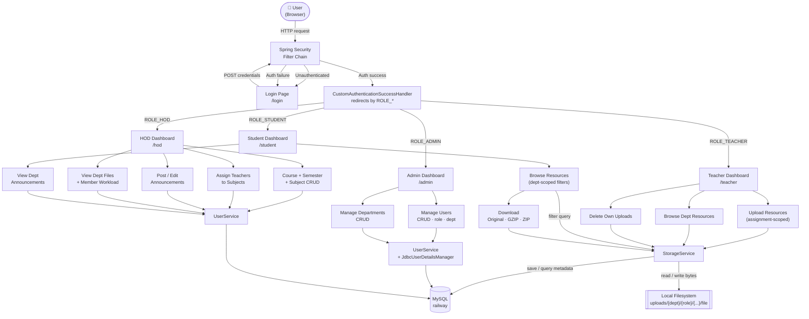
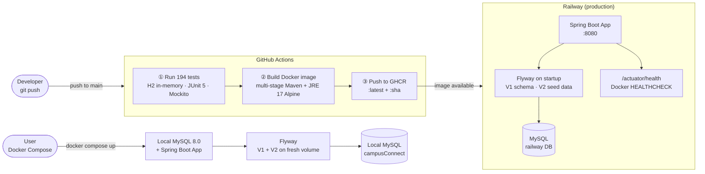
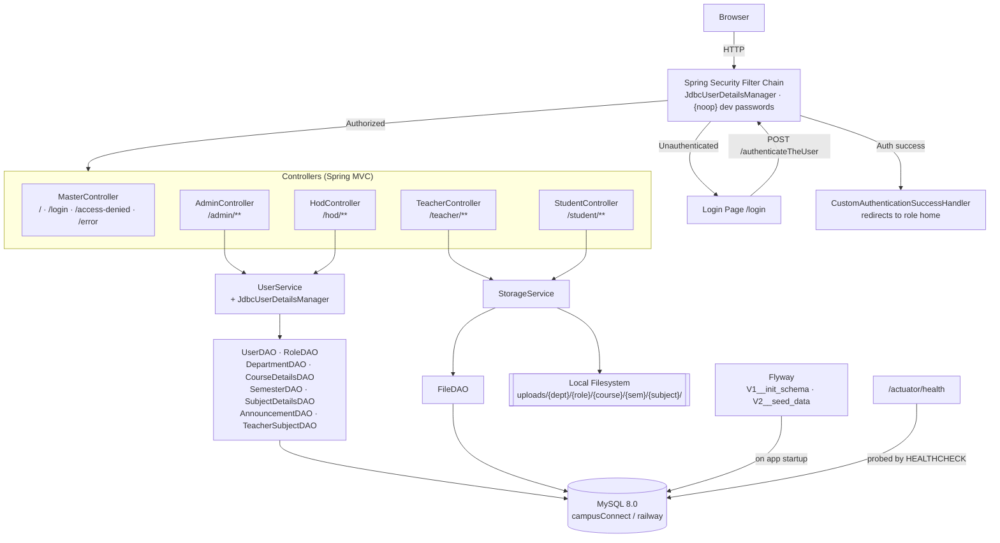

# CampusConnect — Architecture (v1.0)

---

## Application Workflow

End-to-end flow from a browser request through authentication, role dispatch, business logic, and persistence.



---

## Deployment & CI/CD Pipeline



---

## System Architecture



### Layer responsibilities

| Layer | Package | Responsibility |
|-------|---------|----------------|
| Controllers | `controller/` | Receive HTTP, bind form data, enforce ownership, return Thymeleaf view names |
| Service | `service/` | File storage, GZIP/ZIP compression, ownership resolution, Spring Security helpers |
| DAO | `repository/` | Spring Data JPA repositories; all extend `JpaRepository` |
| Entities | `entities/` | JPA `@Entity` classes that map 1-to-1 with MySQL tables |
| Security | `config/` | URL-based role authorization, JDBC authentication, login/logout, success handler |
| Exceptions | `exceptions/` | Custom exception types + global `@ControllerAdvice` handler |
| DTOs | `dto/` | `FileUploadDTO` — carries multipart form data from upload forms to the service layer |
| Migrations | `db/migration/` | Flyway versioned SQL — `V1__init_schema.sql`, `V2__seed_data.sql` |

---

## Role Capability Matrix

| Capability | Admin | HOD | Teacher | Student |
|---|:---:|:---:|:---:|:---:|
| Manage users (CRUD) | ✓ | | | |
| Manage departments | ✓ | | | |
| Manage courses | | ✓ | | |
| Manage semesters | | ✓ | | |
| Manage subjects | | ✓ | | |
| Assign teachers to subjects | | ✓ | | |
| Post announcements | | ✓ | | |
| View dept members + workload | | ✓ | | |
| Upload resources | | | ✓ | |
| Delete own uploads | | | ✓ | |
| Browse + download resources | | | ✓ | ✓ |
| View announcements | | | ✓ | ✓ |
| Change own password | ✓ | ✓ | ✓ | ✓ |

---

## ER Diagram

```mermaid
erDiagram
    department {
        int     department_id    PK
        varchar department_name  UK
    }
    members {
        varchar user_id          PK
        int     id               UK
        varchar email            UK
        char    pw
        tinyint active
        varchar department
        int     dept_id          FK
    }
    roles {
        varchar user_id          PK_FK
        varchar role
    }
    department_details {
        int     department_member_id PK
        int     department_id        FK
        varchar user_name            FK_UK
        varchar role
    }
    course_details {
        int     course_id        PK
        varchar course_name
        int     department_id    FK
    }
    semester {
        int     semester_id      PK
        varchar semester_name
        int     course_id        FK
    }
    subject_details {
        int     subject_id       PK
        varchar subject_name
        int     course_id        FK
        int     semester_id      FK
    }
    file_data {
        int       file_id                PK
        varchar   file_name
        varchar   file_type
        varchar   file_path
        bigint    file_size
        int       uploader_department_id FK
        varchar   uploader_name
        int       course_id              FK
        int       semester_id            FK
        int       subject_id             FK
        timestamp uploaded_at
        varchar   file_role
    }
    announcements {
        int       id             PK
        int       dept_id        FK
        varchar   author         FK
        varchar   title
        text      body
        timestamp created_at
    }
    teacher_subject {
        int     id               PK
        varchar teacher_id       FK
        int     subject_id       FK_UK
    }

    department        ||--o{ members             : "dept_id"
    members           ||--||  roles               : "user_id"
    department        ||--o{ department_details   : "department_id"
    members           ||--o|  department_details  : "user_name"
    department        ||--o{ course_details       : "department_id"
    course_details    ||--o{ semester             : "course_id"
    course_details    ||--o{ subject_details      : "course_id"
    semester          ||--o{ subject_details      : "semester_id"
    department        ||--o{ file_data            : "uploader_department_id"
    course_details    ||--o{ file_data            : "course_id"
    semester          ||--o{ file_data            : "semester_id"
    subject_details   ||--o{ file_data            : "subject_id"
    department        ||--o{ announcements        : "dept_id"
    members           ||--o{ announcements        : "author"
    members           ||--o{ teacher_subject      : "teacher_id"
    subject_details   ||--o| teacher_subject      : "subject_id"
```

**Key design notes:**
- `members.dept_id` is a user's home department; `department_details` is the join table that also captures their role label within that department.
- `roles` is a one-to-one extension of `members` — Spring Security reads from it via `JdbcUserDetailsManager`.
- `file_data.file_path` stores the absolute path on disk; the database holds only metadata.
- `teacher_subject` enforces that at most one teacher is assigned per subject (`UNIQUE KEY uq_subject`).
- `announcements` are department-scoped; only the owning HOD may edit or delete them.

---

## Class / Component Diagram

```mermaid
classDiagram
    class StorageService {
        <<interface>>
        +uploadToFileSystem(FileUploadDTO) void
        +findResourcesUploaded(String) List~FileData~
        +getCurrentOwnersName() String
        +deleteResource(Long) void
        +findAll() List~FileData~
        +findAllDepartment(List~Long~) List~Department~
        +findFilesByFilters(Long,Long,Long,Long,String) List~FileData~
        +compressFileWithGzip(String) InputStream
        +compressFileWithZip(String) InputStream
        +getFileById(Long) Optional~FileData~
    }

    class StorageServiceImplementation {
        +uploadToFileSystem(FileUploadDTO) void
        +findFilesByFilters(Long,Long,Long,Long,String) List~FileData~
        +compressFileWithGzip(String) InputStream
        +compressFileWithZip(String) InputStream
        +getFileById(Long) Optional~FileData~
    }
    StorageServiceImplementation ..|> StorageService

    class MasterController {
        +showPublicLandingPage() String
        +showLoginPage(HttpServletRequest) String
        +accessDenied() String
        +error() String
    }

    class AdminController {
        -JdbcUserDetailsManager userDetailsManager
        -UserService userService
        +getAdminPage(Model) String
        +getStudentsInfo(Model) String
        +addUser(Model) String
        +saveUser(User) String
        +showUserUpdateForm(String, Model) String
        +updateUser(User) String
        +deleteUser(String) String
        +manageDepartment(Model) String
        +saveDepartment(Department) String
        +profile(Model) String
        +saveProfile(...) String
    }

    class HodController {
        -UserService userService
        +homePage(Model) String
        +showAddCoursePage(Model) String
        +saveCourse(CourseDetails) String
        +manageCourse(Model) String
        +updateCourse(...) String
        +deleteCourse(...) String
        +showSemestersPage(...) String
        +saveSemester(...) String
        +deleteSemester(...) String
        +updateSemester(...) String
        +showCurriculumPage(...) String
        +saveSubject(...) String
        +updateSubject(...) String
        +deleteSubject(...) String
        +showAssignTeachersPage(...) String
        +assignTeacher(...) String
        +showDepartmentFilesPage(Model) String
        +showMembersPage(Model) String
        +showAnnouncementsPage(Model) String
        +saveAnnouncement(...) String
        +editAnnouncement(...) String
        +updateAnnouncement(...) String
        +deleteAnnouncement(...) String
        +showWorkloadPage(Model) String
        +profile(Model) String
        +saveProfile(...) String
    }

    class TeacherController {
        -UserService userService
        -StorageService storageService
        +homePage(Model) String
        +showUploadPage(Model) String
        +uploadFile(FileUploadDTO,...) String
        +showBrowsePage(Model) String
        +search(FileUploadDTO, Model) String
        +deleteResource(Long,...) String
        +profile(Model) String
        +saveProfile(...) String
    }

    class StudentController {
        -UserService userService
        -StorageService storageService
        +getStudent(Model) String
        +showBrowsePage(String, Model) String
        +search(FileUploadDTO, Model) String
        +downloadOriginalFile(Long) ResponseEntity
        +downloadGzipFile(Long) ResponseEntity
        +downloadZipFile(Long) ResponseEntity
        +profile(Model) String
        +saveProfile(...) String
    }

    class SecurityConfiguration {
        +filterChain(HttpSecurity) SecurityFilterChain
        +userDetailsManager(DataSource) UserDetailsManager
        +authenticationSuccessHandler() AuthenticationSuccessHandler
    }

    class CustomAuthenticationSuccessHandler {
        +onAuthenticationSuccess(request, response, Authentication) void
    }

    TeacherController --> StorageService
    StudentController --> StorageService
    StorageServiceImplementation --> FileDAO
    AdminController --> UserService
    HodController --> UserService
    TeacherController --> UserService
    StudentController --> UserService
    SecurityConfiguration --> CustomAuthenticationSuccessHandler

    class UserDAO         { <<JpaRepository>> }
    class RoleDAO         { <<JpaRepository>> }
    class DepartmentDAO   { <<JpaRepository>> }
    class CourseDetailsDAO{ <<JpaRepository>> }
    class SemesterDAO     { <<JpaRepository>> }
    class SubjectDetailsDAO{ <<JpaRepository>> }
    class FileDAO         { <<JpaRepository>> }
    class AnnouncementDAO { <<JpaRepository>> }
    class TeacherSubjectDAO{ <<JpaRepository>> }
```



---

## Route Map

### MasterController

| Method | URL | Description |
|--------|-----|-------------|
| GET | `/` | Public landing page |
| GET | `/login` | Login form |
| GET | `/access-denied` | 403 page |
| GET | `/error` | Generic error page |

### AdminController — `/admin/**`

| Method | URL | Description |
|--------|-----|-------------|
| GET | `/admin` | Admin dashboard |
| GET | `/admin/user-management` | List all users |
| GET | `/admin/add-user` | New user form |
| POST | `/admin/save` | Create / update user |
| GET | `/admin/edit-user` | Load user for editing |
| POST | `/admin/delete-user` | Delete user |
| GET | `/admin/manage-department` | List departments |
| POST | `/admin/save-department` | Create department |
| POST | `/admin/delete-department` | Delete department |
| GET | `/admin/profile` | Admin profile page |
| POST | `/admin/save-profile` | Save email / password |

### HodController — `/hod/**`

| Method | URL | Description |
|--------|-----|-------------|
| GET | `/hod` | HOD dashboard |
| GET | `/hod/add-course` | New course form |
| POST | `/hod/save-course` | Create course |
| GET | `/hod/manage-course` | List dept courses |
| POST | `/hod/update-course` | Rename course |
| POST | `/hod/delete-course` | Delete course |
| GET | `/hod/semesters` | Semester list for a course |
| POST | `/hod/save-semester` | Add semester |
| POST | `/hod/update-semester` | Rename semester |
| POST | `/hod/delete-semester` | Delete semester |
| GET | `/hod/curriculum` | Curriculum overview |
| GET | `/hod/add-subject` | New subject form |
| POST | `/hod/save-subject` | Create subject |
| GET | `/hod/manage-subject` | Manage subjects for a course |
| POST | `/hod/update-subject` | Rename subject |
| POST | `/hod/delete-subject` | Delete subject |
| GET | `/hod/assign-teachers` | Teacher assignment page |
| POST | `/hod/assign-teacher` | Assign / remove teacher |
| GET | `/hod/department-files` | All dept uploads |
| GET | `/hod/members` | Dept faculty + students |
| GET | `/hod/announcements` | Announcements list + create form |
| GET | `/hod/edit-announcement` | Edit announcement form |
| POST | `/hod/save-announcement` | Post new announcement |
| POST | `/hod/update-announcement` | Update announcement |
| POST | `/hod/delete-announcement` | Delete announcement |
| GET | `/hod/workload` | Teacher workload view |
| GET | `/hod/profile` | HOD profile |
| POST | `/hod/save-profile` | Save email / password |

### TeacherController — `/teacher/**`

| Method | URL | Description |
|--------|-----|-------------|
| GET | `/teacher` | Teacher dashboard |
| GET | `/teacher/upload` | Upload form (all categories) |
| GET | `/teacher/upload/ppts` | Upload form — Presentations |
| GET | `/teacher/upload/notes` | Upload form — Notes |
| GET | `/teacher/upload/programs` | Upload form — Programs |
| GET | `/teacher/upload/audiobooks` | Upload form — Audio Books |
| GET | `/teacher/upload/reference` | Upload form — Reference Books |
| GET | `/teacher/upload/videos` | Upload form — Videos |
| POST | `/teacher/upload` | Submit file upload |
| GET | `/teacher/browse` | Browse dept resources |
| POST | `/teacher/browse/search` | Filter search |
| POST | `/teacher/delete` | Delete own upload |
| GET | `/teacher/profile` | Teacher profile |
| POST | `/teacher/save-profile` | Save email / password |

### StudentController — `/student/**`

| Method | URL | Description |
|--------|-----|-------------|
| GET | `/student` | Student dashboard |
| GET | `/student/browse` | Browse resources (dept-scoped) |
| POST | `/student/browse/search` | Filter search (dept enforced server-side) |
| GET | `/student/download/original/{id}` | Download original file |
| GET | `/student/download/gzip/{id}` | Download GZIP-compressed |
| GET | `/student/download/zip/{id}` | Download ZIP-compressed |
| GET | `/student/profile` | Student profile |
| POST | `/student/save-profile` | Save email / password |

---

## Environment Configuration

The application reads datasource configuration from environment variables using a two-level fallback chain. Each deployment environment resolves the chain differently.

### Fallback chain (application.properties)

```
spring.datasource.url
  → ${DB_URL}                              # Docker Compose always sets this
  → jdbc:mysql://${MYSQL_HOST:localhost}:${MYSQL_PORT:3306}/${MYSQL_DATABASE:campusConnect}?...
                  └─ Railway sets MYSQL_HOST, MYSQL_PORT, MYSQL_DATABASE

spring.datasource.username
  → ${DB_USERNAME}                         # Docker Compose always sets this
  → ${MYSQL_USER:campusConnect}            # Railway sets MYSQL_USER

spring.datasource.password
  → ${DB_PASSWORD}                         # Docker / .env always sets this
  → ${MYSQL_ROOT_PASSWORD:password}        # Railway MySQL plugin sets this automatically
```

### Per-environment resolution

| Variable              | Docker Compose        | Railway                                    | Local Dev      |
|-----------------------|-----------------------|--------------------------------------------|----------------|
| `DB_URL`              | `jdbc:mysql://db:3306/campusConnect` | not set → MYSQL_* chain used | not set → localhost default |
| `DB_USERNAME`         | `campusConnect`       | not set → MYSQL_USER                       | not set → `campusConnect` |
| `DB_PASSWORD`         | from `.env`           | not set → MYSQL_ROOT_PASSWORD              | not set → `password` |
| `MYSQL_HOST`          | n/a                   | `mysql.railway.internal` (set manually)    | `localhost`    |
| `MYSQL_PORT`          | n/a                   | `3306` (set manually)                      | `3306`         |
| `MYSQL_DATABASE`      | n/a                   | `railway` (set by Railway MySQL plugin)    | `campusConnect`|
| `MYSQL_USER`          | n/a                   | `root` (set manually)                      | `campusConnect`|
| `MYSQL_ROOT_PASSWORD` | from `.env`           | set by Railway MySQL plugin                | `password`     |
| `UPLOAD_DIR`          | `/uploads/`           | `/uploads/`                                | `uploads/`     |

### Critical behaviour note

Spring Boot's `${VAR:fallback}` only activates the fallback when `VAR` is **undefined**. An **empty string** is accepted as-is and will produce a broken JDBC URL (e.g., `jdbc:mysql://:3306/railway`). This is the most common source of Railway datasource failures — always verify actual variable values with `railway variables --service <ServiceName>` before deploying.

---

## Database Migration Strategy

Flyway manages all schema changes. Migrations live in `src/main/resources/db/migration/`.

| File | Purpose |
|------|---------|
| `V1__init_schema.sql` | Creates all 10 tables in FK dependency order |
| `V2__seed_data.sql` | Inserts dummy users, roles, courses, semesters, subjects, announcements, and teacher assignments |
| `V{n}__description.sql` | All future schema changes — `ALTER TABLE`, `CREATE TABLE`, etc. |

**Rules:**
- Never edit a migration file after it has been applied — Flyway checksums each file and will refuse to start if a checksum changes.
- Always add a new `V{n}` file for every schema change.
- Tests use H2 with `spring.flyway.enabled=false`; JPA `create-drop` manages the test schema instead.
