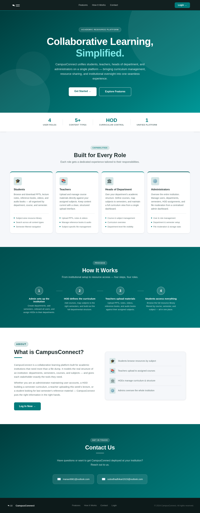
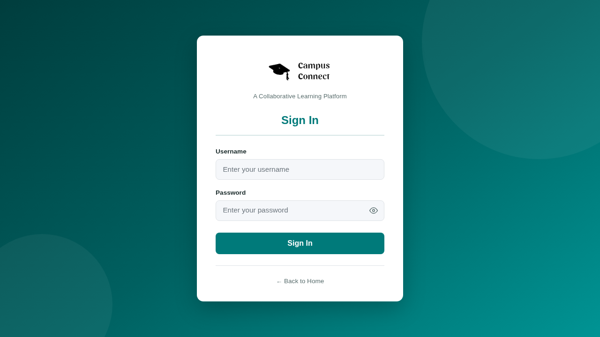
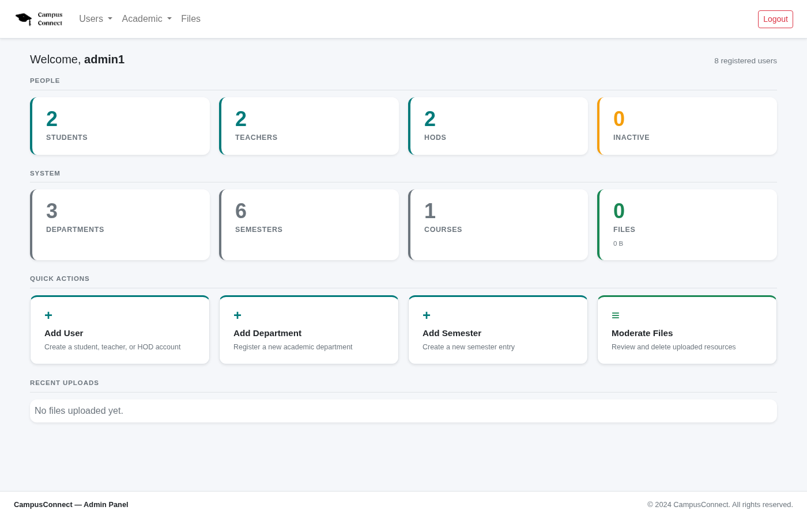

<a name="readme-top"></a>

<div align="center">

# CampusConnect

**A role-based academic management and collaborative learning platform for educational institutions.**

[![CI][ci-shield]][ci-url]
[![Contributors][contributors-shield]][contributors-url]
[![Issues][issues-shield]][issues-url]
[![License: GPL v3][license-shield]][license-url]
[![Docker][docker-shield]][docker-url]

[View on GitHub](https://github.com/subodhadhikari2023/CampusConnect) · [Report a Bug][issues-url] · [Request a Feature][issues-url]

</div>

---

<div align="center">

## Contributors

|  |  |
|:---:|:---:|
| **Subodh Adhikari** | **Manav Agarwal** |
| [![LinkedIn][linkedin-badge]](https://www.linkedin.com/in/subodh-adhikari-4b811a296/) [![GitHub][github-badge]](https://github.com/subodhadhikari2023/) [![Outlook][outlook-badge]](mailto:subodhadhikari2023@outlook.com) | [![LinkedIn][linkedin-badge]](https://www.linkedin.com/in/manav-agarwal-8139b92b8/) [![GitHub][github-badge]](https://github.com/Manav355) [![Outlook][outlook-badge]](mailto:manav9981@outlook.com) |

</div>

---

<details>
  <summary><b>Table of Contents</b></summary>
  <ol>
    <li><a href="#about">About The Project</a></li>
    <li><a href="#screenshots">Screenshots</a></li>
    <li><a href="#features">Features</a></li>
    <li><a href="#built-with">Built With</a></li>
    <li><a href="#getting-started">Getting Started</a>
      <ul>
        <li><a href="#option-1-docker-recommended">Docker (Recommended)</a></li>
        <li><a href="#option-2-manual-setup">Manual Setup</a></li>
        <li><a href="#option-3-oracle-cloud-vm">Oracle Cloud VM</a></li>
      </ul>
    </li>
    <li><a href="#environment-variables">Environment Variables</a></li>
    <li><a href="#development-workflow">Development Workflow</a></li>
    <li><a href="#testing">Testing</a></li>
    <li><a href="#cicd-pipeline">CI/CD Pipeline</a></li>
    <li><a href="#contributing">Contributing</a></li>
    <li><a href="#license">License</a></li>
    <li><a href="#contact">Contact</a></li>
  </ol>
</details>

---

## About

CampusConnect is a **Spring Boot** web application providing a unified academic workspace for four roles — Admin, HOD, Teacher, and Student. Each role has its own dashboard and a permission-scoped set of actions, enforced at every request by Spring Security.

The application is containerised with Docker, tested with JUnit 5 and Mockito, deployed to an Oracle Cloud VM via GitHub Actions, and uses Flyway for zero-touch schema management.

---

## Highlight

194 automated tests — deployed to Oracle Cloud.

## Tech Stack

<div align="center">

**Application Stack**

         

**DevOps & CI/CD**

      

**Testing**

  

</div>

<!-- Portfolio sync reads the bullet list below -->
- Spring Boot
- Thymeleaf
- Spring Security
- Hibernate
- MySQL
- Spring MVC
- Java
- JavaScript
- HTML/CSS
- Docker
- Docker Compose
- GitHub Actions
- GHCR
- Railway
- Maven
- Flyway
- JUnit 5
- H2
- SQL

## Screenshots

<div align="center">

| Landing Page | Login | Admin Dashboard |
|:---:|:---:|:---:|
|  |  |  |
| Hero, feature cards, How It Works | Sign-in card with password toggle | Live stats, quick actions, recent uploads |

</div>

---

## Features

| | Feature | Description |
|---|---|---|
| 🔐 | **Role-Based Access Control** | Four distinct roles (Admin, HOD, Teacher, Student) with permission-scoped endpoints enforced by Spring Security |
| 📊 | **Admin Dashboard** | System-wide user and department CRUD with live statistics |
| 🏫 | **HOD Module** | Course / semester / subject / curriculum management; teacher assignment; announcements; workload view |
| 📁 | **Resource Library** | Teachers upload slides, videos, notes, programs, audio books, and reference material scoped to their assigned subjects |
| 🔍 | **Dept-Scoped Browse** | Teachers and students filter and browse resources within their own department |
| 📦 | **Compressed Downloads** | Download any resource as original, GZIP, or ZIP |
| 📢 | **Announcements** | HODs post department notices; visible to all teachers and students in the department |
| 🛠️ | **Flyway Migrations** | Versioned schema applied automatically on first boot — no manual SQL step |
| ❤️ | **Health Endpoint** | `/actuator/health` for uptime checks and Docker health probes |

---

## Built With

<div align="center">

**Application Stack**

[![Spring Boot][SpringBoot6.js]][SpringBoot6-url]
[![Spring Security][SpringSecurity.js]][SpringSecurity-url]
[![JPA Hibernate][JPA.com]][JPA-url]
[![Thymeleaf][Thymeleaf.js]][Thymeleaf-url]
[![MySQL][MySQL.js]][MySQL-url]
[![HTML][HTML.js]][HTML-url]
[![CSS][CSS.js]][CSS-url]
[![JavaScript][Javascript.js]][Javascript-url]

**DevOps & CI/CD**

[![Docker][DockerBadge.js]][Docker-url]
[![GitHub Actions][GHA.js]][GHA-url]
[![GHCR][GHCR.js]][GHCR-url]
[![Flyway][Flyway.js]][Flyway-url]
[![Actuator][Actuator.js]][Actuator-url]

**Testing**

[![JUnit 5][JUnit.js]][JUnit-url]
[![Mockito][Mockito.js]][Mockito-url]
[![H2][H2.js]][H2-url]
[![Spring Security Test][SST.js]][SST-url]

</div>

---

## Getting Started

---

### Option 1: Docker (Recommended)

No database setup required. Docker Compose starts MySQL 8.0 and the Spring Boot app; Flyway seeds all tables on first boot.

> **Prerequisites:** Docker and Docker Compose

```bash
# Clone
git clone https://github.com/subodhadhikari2023/CampusConnect.git
cd CampusConnect

# Set credentials
cp .env.example .env
# Edit .env — set DB_PASSWORD and MYSQL_ROOT_PASSWORD

# Start
docker compose up --build
```

The app is available at **http://localhost:8080**.

**What happens automatically:**
- MySQL 8.0 container creates the `campusConnect` database
- Spring Boot waits for MySQL health check, then starts
- Flyway runs `V1__init_schema.sql` → `V2__seed_data.sql` — all tables and dummy accounts ready on first boot

```bash
docker compose down        # stop containers
docker compose down -v     # stop and wipe all data (fresh start)
```

---

### Option 2: Manual Setup

> **Prerequisites:** JDK 17, MySQL 8.0+, Maven (or use `./mvnw`)

```bash
git clone https://github.com/subodhadhikari2023/CampusConnect.git
cd CampusConnect
chmod +x setup.sh && ./setup.sh
```

`setup.sh` checks dependencies, creates `.env`, initialises the database if needed, and starts the application. On first run it exits after creating `.env` — fill in `DB_PASSWORD`, then run `./setup.sh` again.

The app is available at **http://localhost:8080**.

**Dummy credentials** — all accounts use password `password`:

| Username | Role    |
|----------|---------|
| admin1, admin2 | Admin |
| hod1, hod2     | HOD   |
| teacher1, teacher2 | Teacher |
| student1, student2 | Student |

---

### Option 3: Oracle Cloud VM

The application is continuously deployed to an Oracle Cloud VM (Oracle Linux 9, `VM.Standard.E2.1.Micro`) at **http://152.67.178.227:8080**. No local setup is needed to view the live version.

The VM runs `docker compose up -d` against the base `docker-compose.yml` (pull-only, no build). A cron job on the VM checks GHCR every 10 minutes for a new image digest and redeploys automatically when CI pushes a new image after a merge to `main`.

**To set up auto-redeploy on a fresh VM:**

After cloning the repo, add the following to the VM's crontab (`crontab -e`):

```
*/10 * * * * /home/opc/CampusConnect/deploy/check-and-redeploy.sh >> /home/opc/redeploy.log 2>&1
```

This checks GHCR every 10 minutes for a new image digest and redeploys only if one is found — no rebuild, no downtime for the database.

---

## Environment Variables

The application uses a layered fallback chain. Docker Compose always sets `DB_URL` / `DB_USERNAME` / `DB_PASSWORD` via the `.env` file, so the fallback variables are never reached in that environment.

```
spring.datasource.url
  → $DB_URL                        ← Docker always sets this
  → jdbc:mysql://$MYSQL_HOST:$MYSQL_PORT/$MYSQL_DATABASE?...

spring.datasource.username
  → $DB_USERNAME                   ← Docker always sets this

spring.datasource.password
  → $DB_PASSWORD                   ← Docker / .env always sets this
  → $MYSQL_ROOT_PASSWORD
```

| Variable              | Docker Compose (prod & local dev) | Local default      |
|-----------------------|-----------------------------------|--------------------|
| `DB_URL`              | `jdbc:mysql://db:3306/campusConnect` | *(unset — localhost)* |
| `DB_USERNAME`         | `campusConnect`                   | `campusConnect`    |
| `DB_PASSWORD`         | from `.env`                       | `password`         |
| `MYSQL_ROOT_PASSWORD` | from `.env`                       | `password`         |
| `UPLOAD_DIR`          | `/uploads/`                       | `uploads/`         |

Copy `.env.example` to `.env` for Docker or local use — it is git-ignored and must never be committed.

---

## Development Workflow

`main` is the only protected branch. **Never commit directly to `main`.** All changes arrive via Pull Request.

```
main  ─────────────────────────────────────────► production (Oracle Cloud VM)
        ▲              ▲             ▲
        │ PR           │ PR          │ PR
feature/*  ────────────┘             │
                                     │
bugfix/*  ───────────────────────────┘
```

| Branch      | Purpose |
|-------------|---------|
| `main`      | Production — Oracle Cloud VM deploys from here; PR only, no direct commits |
| `feature/*` | New features |
| `bugfix/*`  | Bug fixes |
| `hotfix/*`  | Critical production patches |
| `docs/*`    | Documentation-only changes |
| `refactor/*`| Code changes with no behaviour change |

Any branch opens a PR directly against `main`.

```bash
# Start a new branch from main
git checkout main && git pull origin main
git checkout -b feature/your-feature-name

# Write tests first (TDD), then implementation
mvn test   # must be green before committing

git add <files>
git commit -m "feat: describe the change"
git push origin feature/your-feature-name
# Open PR → main
```

---

## Testing

The project has **194 tests** covering all layers.

| Layer | Count | Framework | Coverage |
|---|:---:|---|---|
| Controllers | 136 | `@WebMvcTest` + Mockito | Admin (42), HOD (41), Teacher (32), Student (17), Master (4) — views, model attributes, redirects, flash messages, ownership guards |
| Services | 33 | JUnit 5 + Mockito | UserService — pure unit tests, no Spring context |
| Repositories | 14 | `@DataJpaTest` + H2 | FileDAO, RoleDAO, UserDAO — custom JPQL queries and derived finders |
| Integration | 1 | `@SpringBootTest` | Full context smoke test |

Tests use **H2 in-memory** via `application-test.properties` with `spring.flyway.enabled=false` — no MySQL required in CI.

```bash
mvn test                          # run all 194 tests
mvn test -Dtest=HodControllerTest # run a single class
mvn test -Dtest="*ControllerTest" # run by pattern
```

---

## CI/CD Pipeline

Defined in `.github/workflows/ci.yml`.

```
Push / PR to any branch
         │
         ▼
  ┌──────────────┐
  │  test job    │  mvn test — 194 tests, H2 in-memory
  └──────┬───────┘
         │ green
         ▼
  branch == main?
         │ yes
         ▼
  ┌────────────────────┐
  │  push-image job    │  docker build (multi-stage)
  │                    │  push to GHCR :latest + :<sha>
  └──────┬─────────────┘
         │
         ▼
  VM cron (*/10 min) detects new digest
  → docker compose pull + up -d
  → Flyway applies pending migrations
  → /actuator/health confirms startup
```

**Jobs:**

| Job | Trigger | What it does |
|-----|---------|---|
| `test` | Every push and every PR | `mvn test` with H2 — no MySQL needed |
| `push-image` | Push to `main` only, after `test` passes | Builds Docker image, pushes to GHCR with `:latest` and `:<sha>` tags |

Pull the latest image:

```bash
docker pull ghcr.io/subodhadhikari2023/campusconnect:latest
```

---

## Contributing

See [CONTRIBUTING.md](CONTRIBUTING.md) for the full guide — branch naming, TDD requirements, Javadoc rules, commit message format, and the PR process.

Contributions are welcome. Please open an issue before starting significant work.

---

## License

Distributed under the **GNU General Public License v3.0**.

> This program is free software: you can redistribute it and/or modify it under the terms of the GNU General Public License as published by the Free Software Foundation, either version 3 of the License, or (at your option) any later version.

See [LICENSE](LICENSE) for the full text.

---

## Contact

<div align="center">

| **Subodh Adhikari** | **Manav Agarwal** |
|:---:|:---:|
| [![Outlook][outlook-badge]](mailto:subodhadhikari2023@outlook.com) [![LinkedIn][linkedin-badge]](https://www.linkedin.com/in/subodh-adhikari-4b811a296/) | [![Outlook][outlook-badge]](mailto:manav9981@outlook.com) [![LinkedIn][linkedin-badge]](https://www.linkedin.com/in/manav-agarwal-8139b92b8/) |

</div>

<p align="right">(<a href="#readme-top">back to top</a>)</p>

---

[contributors-shield]: https://img.shields.io/github/contributors/subodhadhikari2023/CampusConnect?style=for-the-badge
[contributors-url]: https://github.com/subodhadhikari2023/CampusConnect/graphs/contributors
[issues-shield]: https://img.shields.io/github/issues/subodhadhikari2023/CampusConnect?style=for-the-badge
[issues-url]: https://github.com/subodhadhikari2023/CampusConnect/issues
[license-shield]: https://img.shields.io/badge/License-GPLv3-blue.svg?style=for-the-badge
[license-url]: https://github.com/subodhadhikari2023/CampusConnect/blob/main/LICENSE
[ci-shield]: https://github.com/subodhadhikari2023/CampusConnect/actions/workflows/ci.yml/badge.svg?style=for-the-badge
[ci-url]: https://github.com/subodhadhikari2023/CampusConnect/actions
[docker-shield]: https://img.shields.io/badge/Docker-available-2496ED?style=for-the-badge&logo=docker&logoColor=white
[docker-url]: https://github.com/subodhadhikari2023/CampusConnect/pkgs/container/campusconnect

[linkedin-badge]: https://img.shields.io/badge/LinkedIn-blue?style=flat-square&logo=linkedin
[github-badge]: https://img.shields.io/badge/GitHub-black?style=flat-square&logo=github
[outlook-badge]: https://img.shields.io/badge/Outlook-blue?style=flat-square&logo=microsoft-outlook

[HTML.js]: https://img.shields.io/badge/HTML5-E34F26?style=for-the-badge&logo=html5&logoColor=white
[HTML-url]: https://html.com/
[CSS.js]: https://img.shields.io/badge/CSS3-1572B6?style=for-the-badge&logo=css3&logoColor=white
[CSS-url]: https://css-tricks.com/
[Javascript.js]: https://img.shields.io/badge/JavaScript-F7DF1E?style=for-the-badge&logo=javascript&logoColor=black
[Javascript-url]: https://developer.mozilla.org/en-US/docs/Web/JavaScript
[Thymeleaf.js]: https://img.shields.io/badge/Thymeleaf-005F0F?style=for-the-badge&logo=thymeleaf&logoColor=white
[Thymeleaf-url]: https://www.thymeleaf.org/
[SpringBoot6.js]: https://img.shields.io/badge/Spring_Boot-6DB33F?style=for-the-badge&logo=springboot&logoColor=white
[SpringBoot6-url]: https://spring.io/projects/spring-boot
[SpringSecurity.js]: https://img.shields.io/badge/Spring_Security-6DB33F?style=for-the-badge&logo=spring&logoColor=white
[SpringSecurity-url]: https://spring.io/projects/spring-security
[MySQL.js]: https://img.shields.io/badge/MySQL-4479A1?style=for-the-badge&logo=mysql&logoColor=white
[MySQL-url]: https://www.mysql.com/
[JPA.com]: https://img.shields.io/badge/Hibernate_JPA-59666C?style=for-the-badge&logo=hibernate&logoColor=white
[JPA-url]: https://www.baeldung.com/learn-jpa-hibernate
[DockerBadge.js]: https://img.shields.io/badge/Docker-2496ED?style=for-the-badge&logo=docker&logoColor=white
[Docker-url]: https://www.docker.com/
[GHA.js]: https://img.shields.io/badge/GitHub_Actions-2088FF?style=for-the-badge&logo=github-actions&logoColor=white
[GHA-url]: https://github.com/features/actions
[GHCR.js]: https://img.shields.io/badge/GHCR-181717?style=for-the-badge&logo=github&logoColor=white
[GHCR-url]: https://github.com/subodhadhikari2023/CampusConnect/pkgs/container/campusconnect
[JUnit.js]: https://img.shields.io/badge/JUnit_5-25A162?style=for-the-badge&logo=junit5&logoColor=white
[JUnit-url]: https://junit.org/junit5/
[Mockito.js]: https://img.shields.io/badge/Mockito-78A641?style=for-the-badge
[Mockito-url]: https://site.mockito.org/
[H2.js]: https://img.shields.io/badge/H2_Database-1021FF?style=for-the-badge
[H2-url]: https://www.h2database.com/
[SST.js]: https://img.shields.io/badge/Spring_Security_Test-6DB33F?style=for-the-badge&logo=spring&logoColor=white
[SST-url]: https://docs.spring.io/spring-security/reference/servlet/test/index.html
[Flyway.js]: https://img.shields.io/badge/Flyway-CC0200?style=for-the-badge&logo=flyway&logoColor=white
[Flyway-url]: https://flywaydb.org/
[Actuator.js]: https://img.shields.io/badge/Spring_Actuator-6DB33F?style=for-the-badge&logo=spring&logoColor=white
[Actuator-url]: https://docs.spring.io/spring-boot/docs/current/reference/html/actuator.html
